# CSC548 Project - Contributing to Firefox

## Justification

After hours of looking for a project to work on, I read that Mozilla was one of the best at keeping open source projects and thus, they have very active contributors. I looked around their github site, but didn't find an issue that I was familiar enough with to fix. I then found a [list of bugs](https://www.joshmatthews.net/bugsahoy/?simple=1) for beginners (by selecting Simple bugs) in Firefox and realized that they didn't keep their source code in Github. There was a [bug](https://bugzilla.mozilla.org/show_bug.cgi?id=1417527) that I could reproduce and knew how to solve, so I decided to take on it!

Following [their steps](https://developer.mozilla.org/en-US/docs/Mozilla/Developer_guide/Introduction) for contributing, I went through a few more hours of downloading the source code to build it locally.

## Documentation

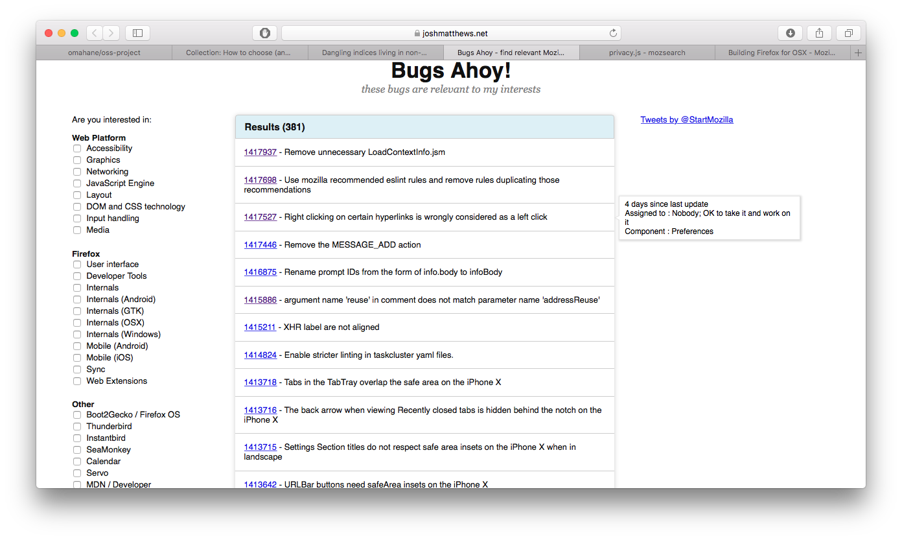  
First, I found the bugs list.

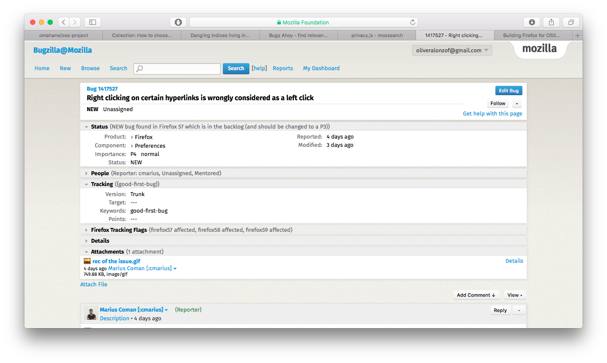  
I then found the specific bug that wasn't taken and I could solve.

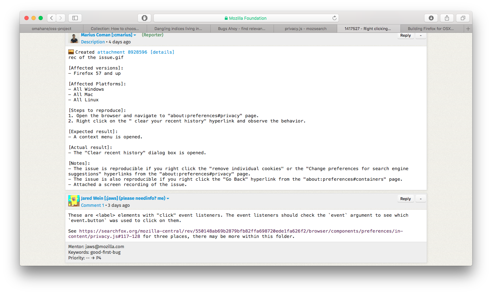  
I read the description of the problem and solution by the mentor.

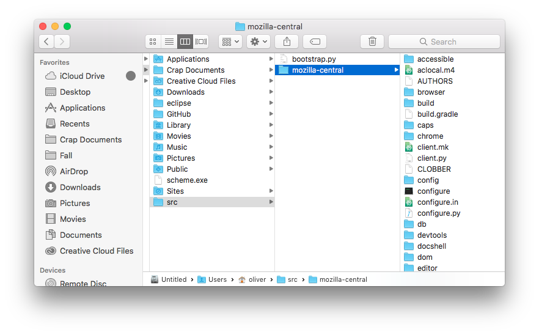  
I cloned the repo locally.

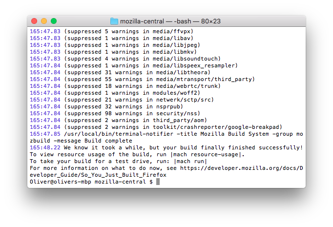  
After fixing some errors that popped up and over 2 hours of waiting, the build process was done!

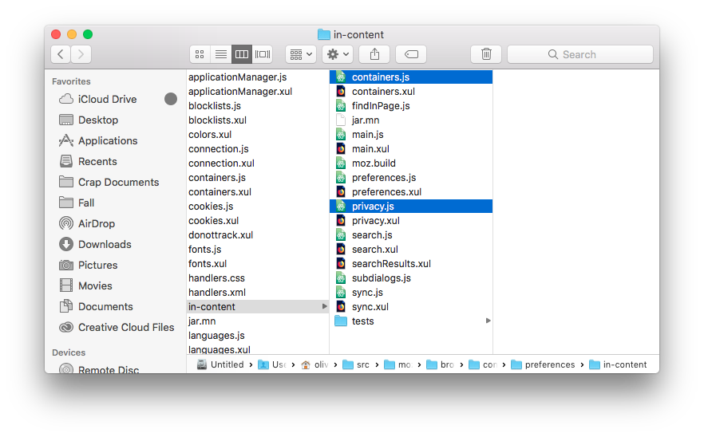  
I found the files with the issues.

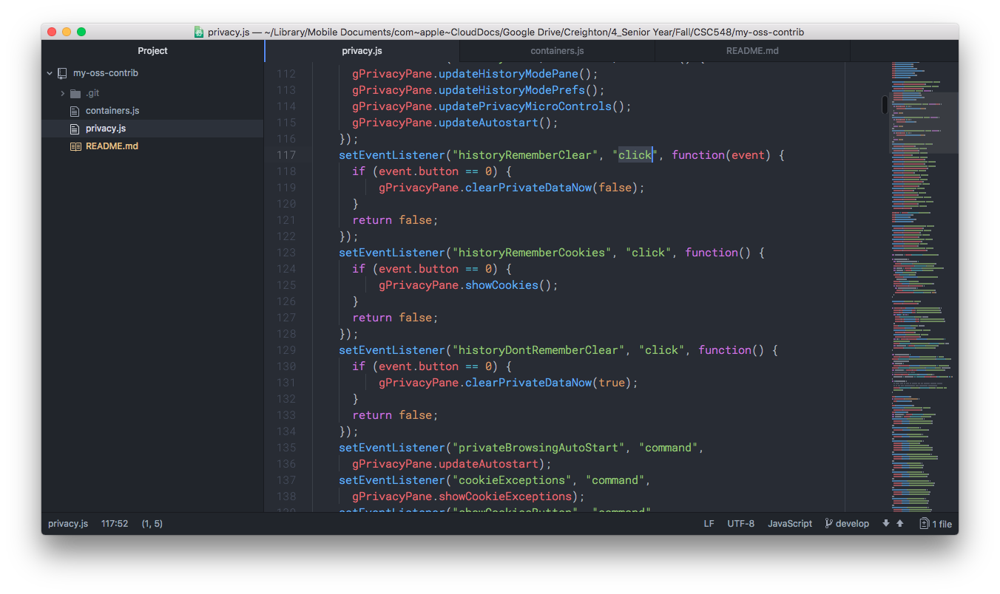  
I fixed the issue in privacy.js

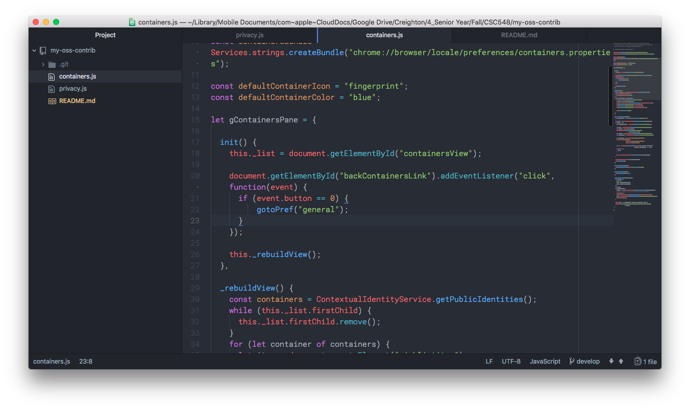  
I fixed the issue in containers.js

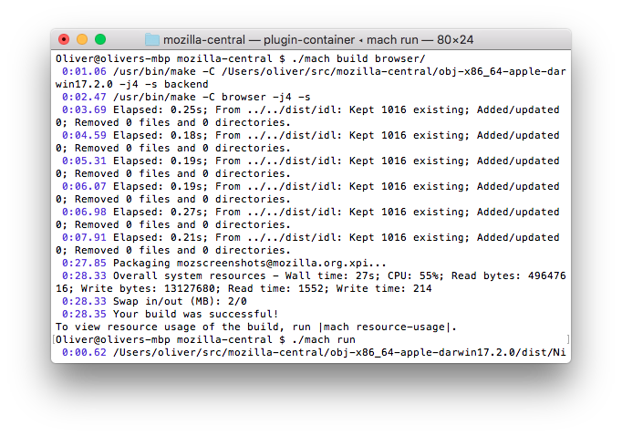  
I rebuilt the browser and ran it for testing. It worked!

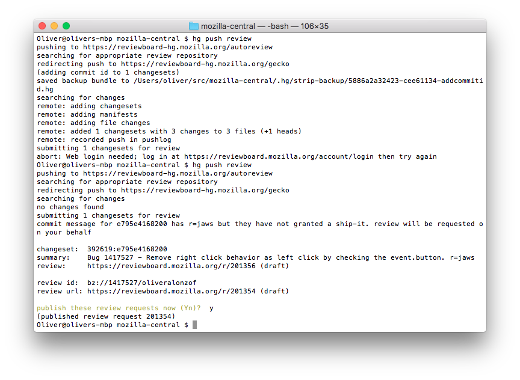  
I committed my code and pushed for review.

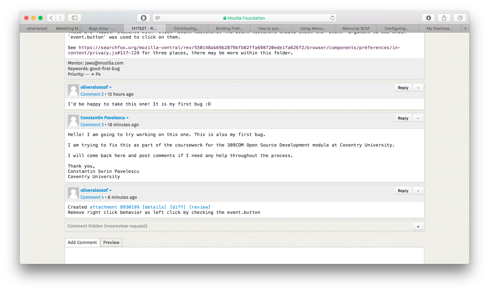  
A comment was automatically added for review! Someone else apparently decided to join in, we'll see what happens with that :sweat_smile:.

## Process

I followed [the guide](https://github.com/collections/choosing-projects) by first fixing a really [minor issue](https://github.com/google/omaha/pull/124) on Google's Omaha project. Then, I read the rest of the text and started to dig a bit deeper.

## Code changeMasterPassword

My contribution was relatively small, but hopefully it makes it to production! It is a wrong action for a right click button. The code changes can be seen in the last few commits. They will be sure that I right click doesn't open the link.
